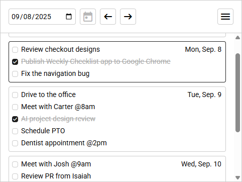

# Weekly Checklist

Weekly checklist application

## Local Development

- Install NodeJS package libraries: `npm install`
- Run development libraries `npm run dev`
- Use the link it provides

## Update NPM libraries

- Run `npm outdated`
- Run `npm i package-name@latest` (for Rapier.js, replace `latest` with `canary`)

## Test Chrome Extension

- Rebuild extension and open Google Chrome
- Click Extensions > Manage Extensions
- Enable Developer mode (top right)
- Click `Load unpacked` and navigate to the `/build` folder
- Open extension within Chrome

## Build for release

- Run `npm run dist` to create zipped files
- Upload to Chrome Webstore